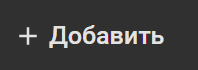
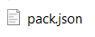
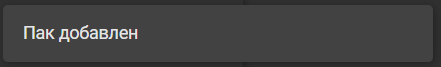

# NeoBoxLauncher

Игровой лаунчер с группировкой по пакам и фильтрами по аттрибутам

## Установка

1. [Скачать последнюю версию](https://github.com/Mishin870/NeoBoxLauncher/releases)
2. Распаковать в любую папку
3. Запустить `NeoBoxLauncher.exe`

## Добавление паков

1. Архив с паком распаковать в любую папку
2. В лаунчере нажать `Добавить`\
   
3. Выбрать файл `pack.json`\
   
4. Готово, пак добавлен\
   

## Создание паков

Инструкция в разработке..